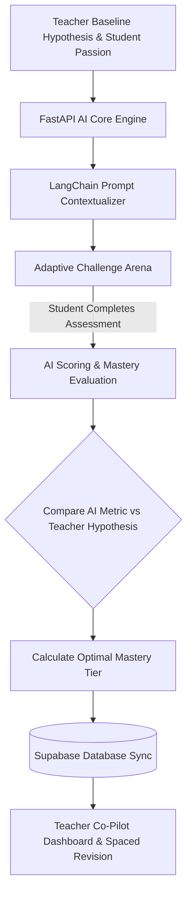

<div align="center">

# White Axe (AEOS)

**Adaptive Educational Operating System that personalizes STEM assessments using student interest context and AI-teacher comparison engines.**

[](LICENSE)
[](https://white-axe.vercel.app/)
[](https://nextjs.org)
[](https://react.dev)
[](https://fastapi.tiangolo.com)
[](https://supabase.com)

[Live Demo](https://white-axe.vercel.app/) · [Report Bug](https://github.com/Justinvcj/White-Axe/issues) · [Request Feature](https://github.com/Justinvcj/White-Axe/issues)

</div>

---

```
┌─────────────────────────────────────────────────────────────────────────────┐
│                  White Axe (AEOS) Adaptive Learning Loop                    │
│                                                                             │
│  ┌───────────────────────┐  ┌───────────────────────┐                       │
│  │ Teacher Observation   │  │ Student Hobbies       │                       │
│  │ Baseline Hypothesis   │  │ (e.g. Cricket, Gaming)│                       │
│  └──────────┬────────────┘  └──────────┬────────────┘                       │
│             │                          │                                    │
│             └──────────────────────────┼────────────────────────┐           │
│                                        ▼                        ▼           │
│  ┌───────────────────────────────────────────────────────────────────────┐  │
│  │     LangChain + FastAPI AI Core Contextualization & Rewrite Engine    │  │
│  └─────────────────────────────────────┬─────────────────────────────────┘  │
│                                        ▼                                    │
│  ┌───────────────────────────────────────────────────────────────────────┐  │
│  │  Adaptive Challenge Arena: Personalized Real-Time STEM Quiz Delivery  │  │
│  └─────────────────────────────────────┬─────────────────────────────────┘  │
│                                        ▼                                    │
│  ┌───────────────────────────────────────────────────────────────────────┐  │
│  │  Dual-Perspective AI vs Teacher Evaluation -> Optimal Mastery Tier    │  │
│  └───────────────────────────────────────────────────────────────────────┘  │
└─────────────────────────────────────────────────────────────────────────────┘
```

> Static educational assessments present rigid problem contexts that disengage students while overburdening teachers who lack time to rewrite individualized quizzes for every student.
> White Axe (AEOS) merges teacher intuition with real-time AI contextualization, transforming STEM test questions into scenarios tailored to student passions (e.g., teaching physics via cricket mechanics) while computing unbiased mastery tiers.

---

## Features

- **Interest-Driven Contextualization** — Rewrites physics and STEM assessment questions automatically to align with student passions (sports, gaming, music).
- **Dual-Perspective Evaluation** — Evaluates real-time AI performance metrics against teacher baseline hypotheses to assign unbiased mastery tiers (C1 Advanced, C2 Proficient, C3 Struggling).
- **Adaptive Challenge Arena** — Calibrates quiz difficulty dynamically based on continuous assessment response telemetry (latency, clickstreams, hints used).
- **Ebbinghaus Spaced Repetition** — Employs mathematical decay curves ($R = e^{-t / S}$) to schedule timely revision queues before knowledge decays.
- **Teacher Co-Pilot Dashboard** — Equips educators with student mastery analytics, interest rosters, and 40-minute automated differentiated lesson planners.
- **Offline-Ready Progressive Web App** — Configured with Next PWA for reliable classroom access on low-bandwidth networks.

---

## How It Works



---

## Quick Start

### Prerequisites

| Requirement | Version | Notes |
|---|---|---|
| [Node.js](https://nodejs.org/) | 18+ | Frontend runtime |
| [Python](https://www.python.org/) | 3.10+ | AI Core backend runtime |
| [Supabase](https://supabase.com/) | Cloud / Local | PostgreSQL database and authentication |

### Installation

1. Clone the repository:
   ```bash
   git clone https://github.com/Justinvcj/White-Axe.git
   cd White-Axe
   ```

2. Configure and run the Frontend:
   ```bash
   cd aeos-frontend
   npm install
   cp .env.example .env.local
   npm run dev
   ```

3. Configure and run the AI Core Backend (separate terminal):
   ```bash
   cd ../aeos-ai-core
   pip install -r requirements.txt
   cp .env.example .env
   uvicorn app.main:app --reload --port 8000
   ```

### Usage

Visit the live deployment at [https://white-axe.vercel.app/](https://white-axe.vercel.app/) or open `http://localhost:3000` locally to access student and teacher portals.

---

## Configuration

| Variable | Required | Default | Description |
|---|---|---|---|
| `NEXT_PUBLIC_SUPABASE_URL` | Yes | — | Supabase project URL |
| `NEXT_PUBLIC_SUPABASE_ANON_KEY` | Yes | — | Supabase anonymous public key |
| `SUPABASE_SERVICE_ROLE_KEY` | Yes | — | Supabase service role key for AI backend |
| `OLLAMA_URL` | No | `http://localhost:11434` | Local Ollama endpoint for LLM generation |

---

## Tech Stack

| Layer | Technology |
|---|---|
| Frontend | Next.js 16 (Turbopack), React 19, TypeScript, Tailwind CSS v4, Framer Motion, Radix UI |
| AI Backend | FastAPI, Uvicorn, LangChain, LangChain Community, Pydantic, NumPy |
| Persistence & Auth | Supabase (PostgreSQL with Row Level Security) |
| Mobile & Offline | Next PWA (`@ducanh2912/next-pwa`) |
| Deployment | Vercel |

---

## Contributing

Contributions are welcome. Please open an issue first to discuss what you would like to change.

1. Fork the Project
2. Create your Feature Branch (`git checkout -b feat/AEOSFeature`)
3. Commit your Changes (`git commit -m 'feat: add AEOS feature'`)
4. Push to the Branch (`git push origin feat/AEOSFeature`)
5. Open a Pull Request

---

## License

Distributed under the MIT License. See [LICENSE](LICENSE) for details.
